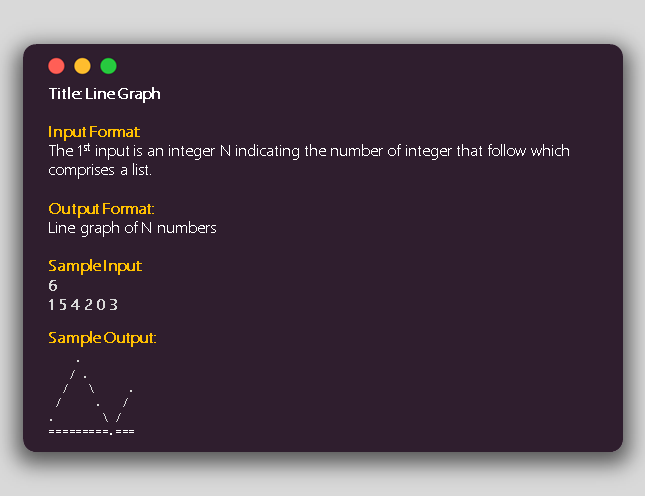

# Compilation of my solutions for the various programming challenges
Solution to the challenges are inside the `./solutions` folder

Challenge infos are inside the `./challenges` folder

## 🚀 Outline
- [Lo Shu Magic Square](#lo-shu-magic-square)
- [Line Graph](#lne-graph)
- [Pyramid Text](#pyramid-text)
- [Triangular Numbers](#triangular-numbers)

## 💎 Challenges
### Lo Shu Magic Square
[Challenge Link](https://www.facebook.com/DailyCodesLang/photos/a.2577306715626298/2857101104313523/?type=3&theater)

Click [here](./solutions/lo_shu_magic_square.cpp) for solution (C++)

### Line Graph
[Challenge Link](https://www.facebook.com/DailyCodesLang/photos/a.2577306715626298/2853332161357084/?type=3&theater)

Click [here](./solutions/line_graph.cpp) for solution (C++)

### Pyramid Text
[Challenge Link](https://www.facebook.com/DailyCodesLang/photos/a.2577306715626298/2853329368024030/?type=3&theater)

Click [here](./solutions/pyramid_text.cpp) for solution (C++)

### Triangular Numbers
[Challenge Link](https://www.facebook.com/DailyCodesLang/photos/a.2577306715626298/2829159023774398/?type=3&theater)

Click [here](./solutions/triangular_numbers.cpp) for solution (C++)

## 🖐🏻 Author
Kristian Espina